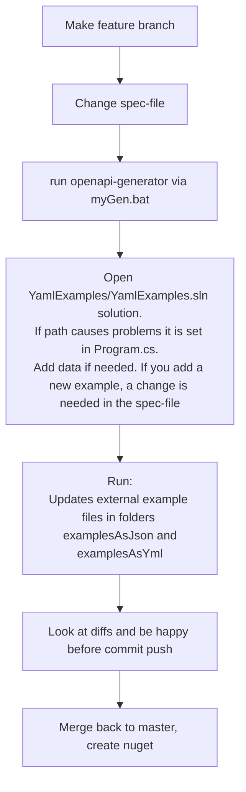

Steps in changing openapi yaml 

The files in the examplesAsJson folder are not needed by the system, and adds no info to the end user, but coping 
from the examples in swagger gui is somewhat tricky so these files migth be usefull for that.
(The files in the examples folder will become obsolete) 

The instruction to use myGen.bat to generate is just to make sure the output code ends up where YamlExamples.sln expect it. 

 
