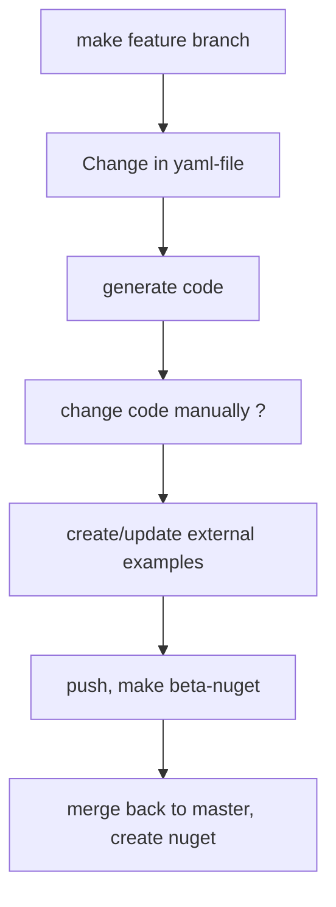

Steps in changing openapi yaml 

```mermaid
  graph TD;
      A0[make feature branch]-->A
      A[Change in yaml-file]-->B[generate code];
      B-->C[change code manually ?];
      C-->D[create/update external examples];
      D-->E[push, make beta-nuget];
      E-->F[ merge back to master, create nuget];
```
