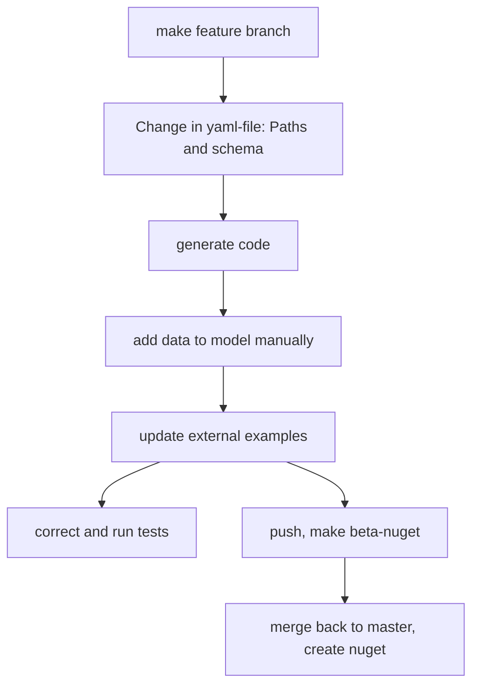

Steps in changing openapi yaml 

The yaml files has external examples which are files on master. These urls should not be changed, so if they cannot be relative, they should always show master. This means the swagger gui form a feature branch will have "old" examples. 

