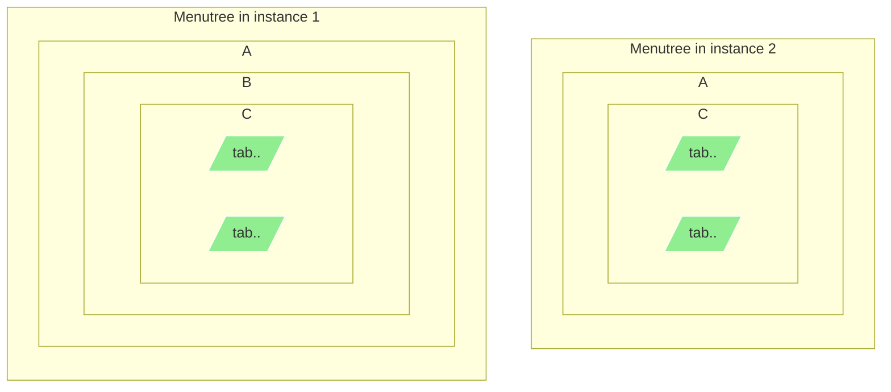
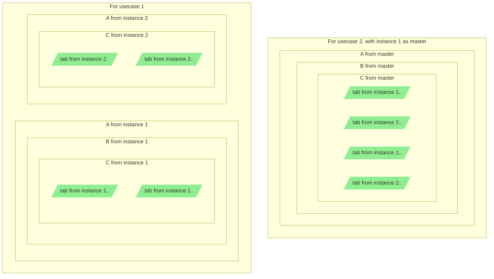

## How to merge multiple menutrees?
There are 2 usecases:

## Use case 1  
In the "new" pxweb the database is removed and the idea is to have multiple instances of pxweb instead.
In the "old" pxweb menu navigation has two screens, first select database, then select table.
The databases may be viewed as nodes on root in a bigger menu.
This may be solved by an api that merges the content of two or more instances, so that the old databases are now nodes on root in the new menu.

## Use case 2
Statistics Norway have been asked to make a portal for official statistics, where, for instance, statistics on unemployment from both the NSI and 
the unemployment office should be presented together.
In this case, we will probably need some sort of master. 

The procedure for merging the 2 usecases will probably be different.  

A Folder in the menutree has a list of subfolders, a list of table and perhaps some headings.
The id of a folder or a table is unique in the instance, but the same folder(id) may be present in two instances.   

What should the result of merging these be?

For usecase 1 the id-string in ..Portal_instance/navigate/{id} calls will probably have to contain both the instanceId and the folderId.
The config endpoint should probably have a list of instances and the "navigational" endpoints should have an "exclude these instances" parameter.
The "navigational" endpoints will probably have to manipulate some of the returned urls.  
 
