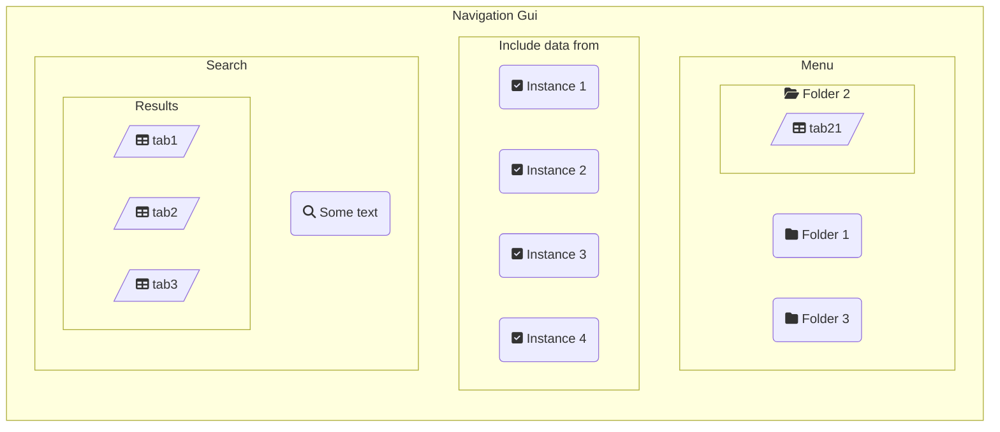

If the config says there is only one source the "Include data from" should not be present.
All apicalls should have an "exclude_db" parameter with a list of the unchecked instances.

```mermaid
flowchart LR
  subgraph A [Navigation Gui]
  direction TB
  subgraph Menu
    M1("fa:fa-folder Folder 1")
    subgraph M2["fa:fa-folder-open Folder 2"]
      M21[/fa:fa-table tab21/]
    end
    M3("fa:fa-folder Folder 3")
  end
  subgraph Include data from
    I1("fa:fa-check-square Instance 1")
    I2("fa:fa-check-square Instance 2")
    I3("fa:fa-check-square Instance 3")
    I4("fa:fa-check-square Instance 4")
  end
  subgraph Search
    s1("fa:fa-search Some text")
    direction TB
    subgraph Results
      r1[/fa:fa-table tab1/]
      r2[/fa:fa-table tab2/]
      r3[/fa:fa-table tab3/]
    end 
  end
end
```
