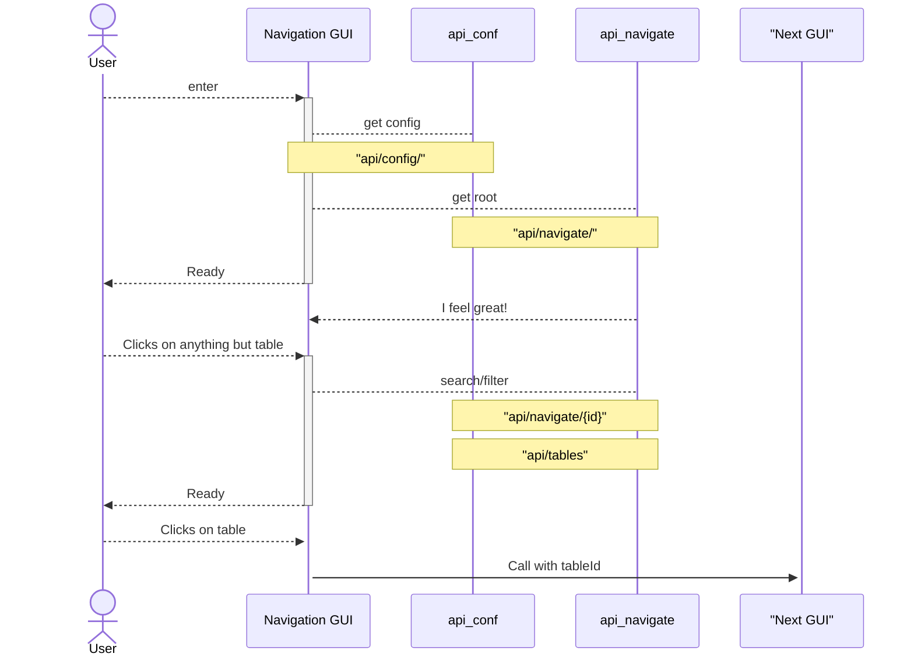

Step 1

```mermaid
sequenceDiagram
    actor User
    participant GUI as Navigation GUI
    User-->>+GUI:enter
    api_conf-->GUI:get config
    Note over GUI, api_conf: "api/config/"
    GUI-->api_navigate: get root
    Note over api_conf, api_navigate: "api/navigate/"
    GUI-->>-User: Ready
    api_navigate-->>GUI: I feel great!
    User-->>+GUI:Clicks on anything but table
    GUI-->api_navigate: search/filter
    Note over api_conf, api_navigate: "api/navigate/{id}"
    Note over api_conf, api_navigate: "api/tables"
    GUI-->>-User: Ready
    User-->>+GUI:Clicks on table
    GUI->>+"Next GUI": Call with tableId
```
